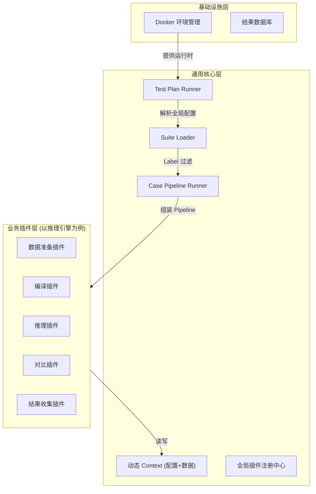

# 设计文档

## 1. 设计目标
构建一套**通用、配置驱动、插件化**的自动化测试底座，通过加载不同的插件包（如“Sample Project测试插件包”），实现对不同被测对象的自动化测试。

- **通用核心 (Common Core)**：仅负责调度、配置解析、插件管理和结果收集，不包含具体业务逻辑。
- **业务插件化 (Domain Plugins)**：推理引擎测试逻辑（如 Compile, Infer）全部封装为插件。
- **环境标准化 (Environment as Code)**：内置 Docker 环境管理，确保测试环境一致性。
- **分层管理 (Hierarchy)**：支持 Test Plan -> Test Suite -> Test Case 三级管理体系。

## 2. 整体架构设计

框架分为 **基础设施层**、**核心调度层** 和 **业务插件层**。



---

## 3. 核心设计亮点 (Design Highlights)

框架采用精简而强大的设计模式，确保扩展性和易用性。

### 3.1 统一的 Pipeline 机制
所有的测试执行逻辑被抽象为一条线性流水线 (Pipeline)。
- **原子化**：每个环节（加载模型、推理、对比）都是一个独立的原子步骤。
- **可编排**：通过 Config 文件灵活调整步骤顺序、增删步骤，无需修改代码。
- **配置驱动**：Pipeline 的定义完全声明式，支持动态加载。

### 3.2 明确的 Case 抽象 (Step / Checker / Collector)
我们将 Pipeline 中的节点细分为三类，职责分离：
- **Steps (Action)**：执行动作。如：`ModelLoader`, `EngineCompiler`, `InferenceRunner`。负责产生数据或改变状态。
- **Checkers (Verification)**：验证结果。如：`NumericsComparator`, `PerformanceChecker`。负责断言，失败会直接影响 Case 状态。
- **Collectors (Reporting)**：收集数据。如：`JsonResultCollector`, `ConsoleCollector`。无论 Case 成功与否通常都会执行，用于生成报告。

### 3.3 灵活的 Label-Selector 机制
通过标签 (Labels) 实现用例的高效管理与筛选。
- **Case 打标**：在 Case Config 中定义 `labels=['daily', 'smoke', 'gpu']`。
- **Suite 筛选**：在 Suite Config 中通过 `include_labels` 和 `exclude_labels` 动态圈选要执行的用例。
- **场景复用**：同一个 Case 文件可以被不同的 Suite 复用（如 Daily Suite 跑全量，Smoke Suite 只跑核心链路）。

### 3.4 强大的插件化架构 (Plugin System)
基于 `mmengine.Registry` 实现的插件系统，实现了核心框架与业务逻辑的完全解耦。
- **Scope 隔离**：支持多级注册表（Registry Scope），不同推理引擎（如 TensorRT, OpenVINO）的插件可以同名共存（`trt.Compiler`, `ov.Compiler`）。
- **即插即用**：只需安装对应的 Python 包并在配置中引用，即可扩展框架能力。

### 3.5 全局上下文 (Global Context)
Context 是贯穿整个生命周期的“黑板”，融合了配置与数据。
- **配置层叠**：自动合并 `Global Config` (Plan级) 和 `Case Config` (Case级)，Case 级配置优先。
- **数据总线**：Step 间通过 `context.set()` 和 `context.get()` 传递中间产物（如模型对象、推理结果 Tensor），解耦了步骤间的强依赖。

---

## 4. 核心概念与层级体系

框架引入三层管理结构来满足从 CI/CD 到日常开发的各类需求。

### 4.1 第一层：测试计划 (Test Plan)
**职责**：定义“在什么环境下，跑哪些套件，用什么全局配置”。
- **环境绑定**：指定使用的 Dockerfile 或镜像。
- **全局配置**：定义适用于该计划下所有 Case 的公共参数（如 `target_device='A100'`, `engine_version='v2.0'`）。
- **套件引用**：包含哪些 Test Suite。

### 4.2 第二层：测试套件 (Test Suite)
**职责**：用例的逻辑集合与过滤。
- **Label 机制**：通过 Label（如 `daily`, `smoke`, `ops`）动态筛选要执行的 Case。
- **Case 聚合**：引用具体的 Case 配置文件或目录。

### 4.3 第三层：测试用例 (Test Case)
**职责**：定义具体的执行流水线 (Pipeline)。
- **Step 组装**：通过 Config 编排具体步骤。
- **Context 交互**：步骤间通过 Context 传递数据。

---

## 5. 详细模块设计

### 5.1 增强的上下文 (Enhanced Context)
Context 不仅是数据黑板，更是配置中心。核心层会自动将 `Test Plan` 和 `Test Case` 中的配置合并注入 Context，供 Step 使用。

```python
from core.utils import merge_config
from core.status import CaseStatus

class TestContext:
    def __init__(self, global_config, case_config):
        # 1. 配置视图 (只读建议)
        # 优先级：Case Config > Global Config
        self.config = merge_config(global_config, case_config)
        
        # 2. 数据黑板 (读写)
        # 用于步骤间传递中间产物，如 model_ir, output_tensor
        self.data = {} 
        
        # 3. 运行时状态
        # 使用 CaseStatus 枚举 (PENDING, RUNNING, SUCCESS, FAILED, ERROR)
        self.status = CaseStatus.PENDING
```

**Step 实现示例：**
```python
from core.interface import BaseStep
from core.context import TestContext

class MyEngineCompiler(BaseStep):
    def process(self, context: TestContext):
        # 从 Context 配置中灵活读取参数
        flags = context.config.get('compile_flags', '-O3') 
        dump_ir = context.config.get('dump_ir', False)
        
        # 执行逻辑
        model = context.data['model_path']
        # ... compile logic ...
```

### 5.2 环境管理 (Environment Management)
框架仓库根目录下统一管理 Dockerfile。

**目录结构建议：**
```text
/environments
    /holmes:torch2.6-cuda12.3-ubuntu22.04-py310
        Dockerfile
        requirements.txt
    /holmes:torch2.4-cuda12.3-ubuntu22.04-py310
        Dockerfile
```

**运行逻辑：**
Runner 启动时，检查 Test Plan 指定的 environment 名称 -> 查找对应的 Dockerfile -> (构建/拉取)镜像 -> 在容器内启动测试进程。

---

## 6. 配置文件示例

### 6.1 Test Plan 配置 (daily_plan.py)
```python
# 指定运行环境 (对应 environments/cuda11/Dockerfile)
environment = dict(
    type='docker',
    path='environments/cuda11', 
    shm_size='8g'
)

# 全局配置 (将被注入到所有 Case 的 Context 中)
global_config = dict(
    target_device='T4',
    compiler_flags='--use_fast_math'
)

# 包含的套件
suites = [
    'test/suites/resnet_suite.py',
    'test/suites/bert_suite.py'
]
```

### 6.2 Test Suite 配置 (test/suites/resnet_suite.py)
```python
# 扫描路径
case_root = 'test/cases/resnet'

# 过滤策略：只运行带有 'daily' 标签 且 不带有 'flaky' 标签的 case
selector = dict(
    include_labels=['daily'],
    exclude_labels=['flaky']
)
```

### 6.3 Test Case 配置 (test/cases/resnet/resnet50_fp16.py)
```python
# Case 元数据 (Metadata)
metadata = dict(
    name='ResNet50 FP16 Inference',
    ID='CASE-001',
    creator='QA-Team'
)

# Case 级别的标签定义
labels = ['daily', 'performance', 'vision']

# 具体的执行 Pipeline
pipeline = [
    # 步骤 1: 准备数据
    dict(type='demo.ModelLoader', uri='oss://models/resnet50.onnx'),
    
    # 步骤 2: 编译 (使用 Context 中的 compile_flags)
    dict(type='demo.MyEngineCompiler'), 
    
    # 步骤 3: 推理
    dict(type='demo.MyEngineRunner'),
    
    # 步骤 4: 结果对比
    dict(type='demo.NumericsComparator', rtol=1e-3),

    # 步骤 5: 结果收集 (Console, JSON)
    dict(type='demo.ConsoleCollector'),
    dict(type='demo.JsonResultCollector', output_file='result.json')
]
```

---

## 7. 执行模式与 CLI 设计 (Execution Modes)

框架提供统一的 CLI 入口 `run.py`，支持两种核心运行模式，满足 CI 批量运行和本地调试需求。

### 7.1 计划模式 (Plan Mode) - 用于 CI/CD
执行完整的 Test Plan，自动处理 Docker 环境构建与销毁。

```bash
# 运行 Daily 测试计划
python run.py plan test/plans/daily_plan.py

# 覆盖部分全局变量 (可选)
python run.py plan test/plans/daily_plan.py --options global_config.target_device=A100
```

### 7.2 单例模式 (Case Mode) - 用于本地开发调试
直接运行单个 Case 文件，支持快速验证。

```bash
# 默认在本地环境直接运行（不启动 Docker，适合快速调试逻辑）
python run.py case test/cases/resnet/resnet50_fp16.py

# 指定在 Docker 环境中运行（挂载当前代码）
python run.py case test/cases/resnet/resnet50_fp16.py --env holmes:torch2.6-cuda12.3-ubuntu22.04-py310

# 覆盖 Context 参数
python run.py case test/cases/resnet/resnet50_fp16.py --options compile_flags="-O0 -g"
```

### 7.3 列表模式 (List Cases) - 用于查看 Plan 内容
列出指定 Plan 中包含的所有 Case 文件路径，支持导出为 CSV 格式以便于后续入库，单用例执行。

```bash
python run.py list-cases test/plans/daily_plan.py

# 导出到 CSV
python run.py list-cases test/plans/daily_plan.py --csv cases.csv
```

**CSV 导出字段：**
- `case ID`: Case 元数据中的 ID
- `name`: Case 元数据中的名称
- `suite`: 所属 Suite 路径
- `case path`: Case 文件路径
- `global config`: Plan 中定义的全局配置 (JSON)

---

## 8. 插件化系统 (Registry)

为了实现通用性，框架核心不包含任何具体业务逻辑，通过 Registry 动态加载。

```python
# 核心定义
from core.registry import Registry, STEPS, COLLECTORS
from core.interface import BaseStep, BaseCollector

# 扩展 Scope 定义 (在插件包中)
DEMO_STEPS = Registry('demo_steps', scope='demo', parent=STEPS)

# 扩展：推理引擎插件包 (sample_project plugins)
@DEMO_STEPS.register_module()
class MyEngineCompiler(BaseStep): ...

# 扩展：Web 测试插件包 (holmes_web_plugins)
@STEPS.register_module()
class HttpRequestStep(BaseStep): ...

# 扩展：结果收集插件
@DEMO_STEPS.register_module() # 注册到 STEPS 以便在 Pipeline 中直接使用
@COLLECTORS.register_module()
class JsonResultCollector(BaseCollector): ...
```

## 9. 总结

本设计通过 **Test Plan -> Suite -> Case** 的三层模型解决了从环境定义到用例执行的完整管理问题，并通过 **Context 配置注入** 机制实现了步骤间的灵活参数传递。框架核心保持通用，配合 **Plugin** 机制，可完美支持推理引擎测试，同时也具备支持未来其他类型测试的能力。